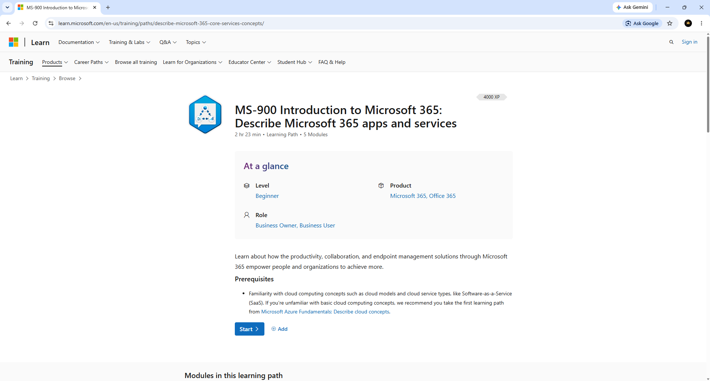
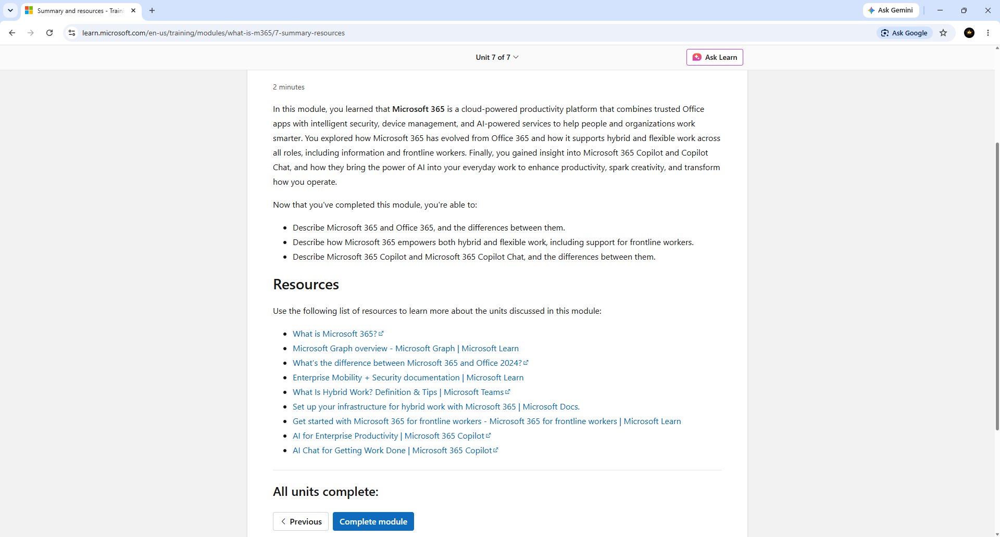
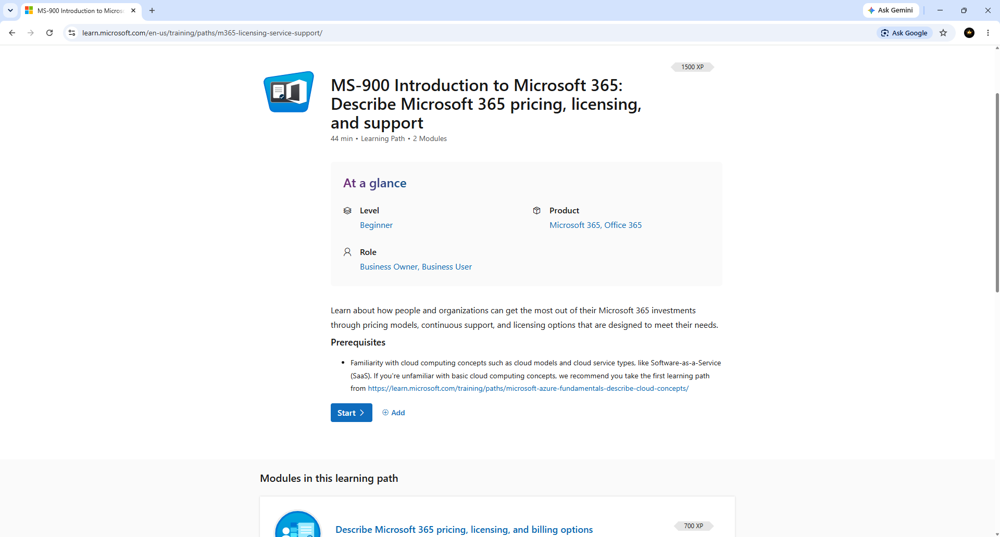
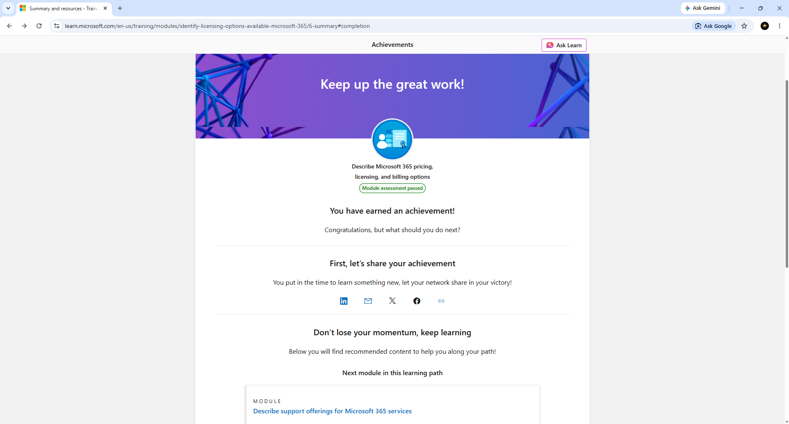
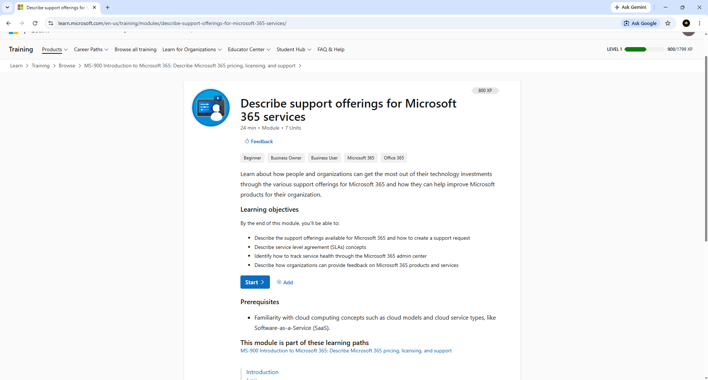
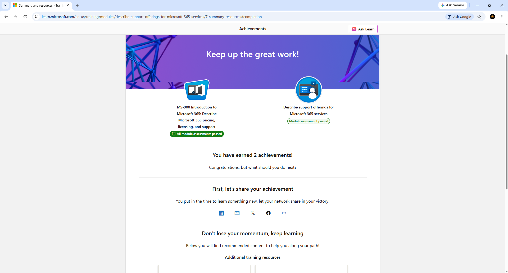

# Darwin-Microsoft-365-Administration-Lab
Hands-on Microsoft 365 Administration lab demonstrating Microsoft Learn training in Microsoft 365 services, licensing, security, compliance, and Help Desk administration concepts.

## Overview

This repository documents my hands-on Microsoft 365 Administration learning through Microsoft Learn. It demonstrates foundational Microsoft 365 administration skills relevant to Help Desk and IT Support roles, including Microsoft 365 services, licensing, security, compliance, and support.

## Objectives

## 1. Microsoft 365 Apps and Services

Completed the Microsoft Learn learning path covering Microsoft 365 applications, collaboration tools, and cloud services.

**Evidence**

---

## 2. What Is Microsoft 365?

Completed the introductory Microsoft Learn module covering Microsoft 365 services and cloud productivity.

**Evidence**

---

## 3. Microsoft 365 Security and Compliance

Topics covered:

- Microsoft Entra ID
- Identity Management
- Security
- Compliance
- Threat Protection

**Evidence**

---

## 4. Microsoft 365 Pricing, Licensing, and Support

Topics covered:

- Licensing
- Billing
- Subscription Models
- Pricing

**Evidence**

---

## 5. Pricing, Licensing, and Billing Module Completion

Successfully completed the Microsoft Learn assessment for Microsoft 365 pricing, licensing, and billing.

**Evidence**

---

## 6. Microsoft 365 Support Offerings

Topics covered:

- Microsoft Support
- Service Requests
- Service Health
- Service Level Agreements (SLAs)

**Evidence**

---

## 7. Microsoft 365 Support Offerings Completion

Successfully completed the Microsoft Learn assessment for Microsoft 365 support services.

**Evidence**

---

# Skills Demonstrated

- Microsoft 365 Administration
- Microsoft Entra ID
- Identity Management
- Microsoft 365 Licensing
- Microsoft 365 Support
- Service Health Monitoring
- Security Fundamentals
- Compliance Fundamentals
- Microsoft Learn
- Cloud Administration
- Help Desk Fundamentals

---

# Technologies Used

- Microsoft 365
- Microsoft Entra ID
- Microsoft Learn
- Microsoft 365 Admin Center
- Microsoft Defender
- Microsoft Purview
- Microsoft Teams

---

# Career Relevance

This project demonstrates practical Microsoft 365 administration skills applicable to:

- IT Help Desk Technician
- IT Support Specialist
- Service Desk Analyst
- Desktop Support Technician
- Microsoft 365 Administrator
- Junior Systems Administrator
- Compliance
- Troubleshooting
- Service Health Monitoring
- Help Desk Operations

---

## Author

**Darwin Brown**
